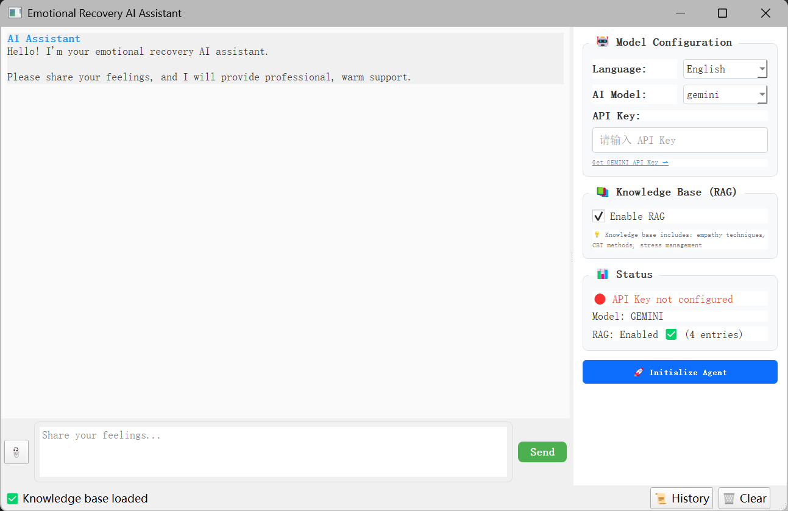
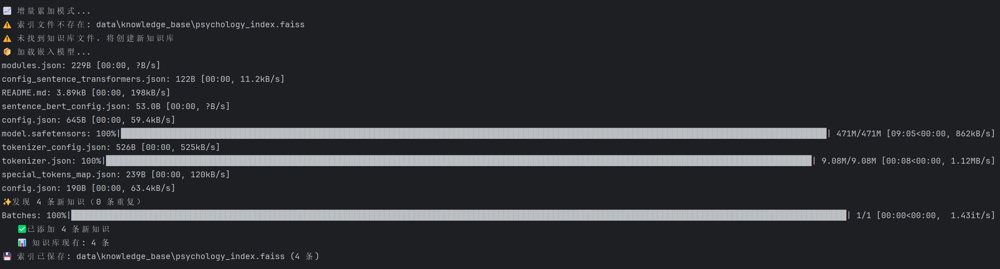
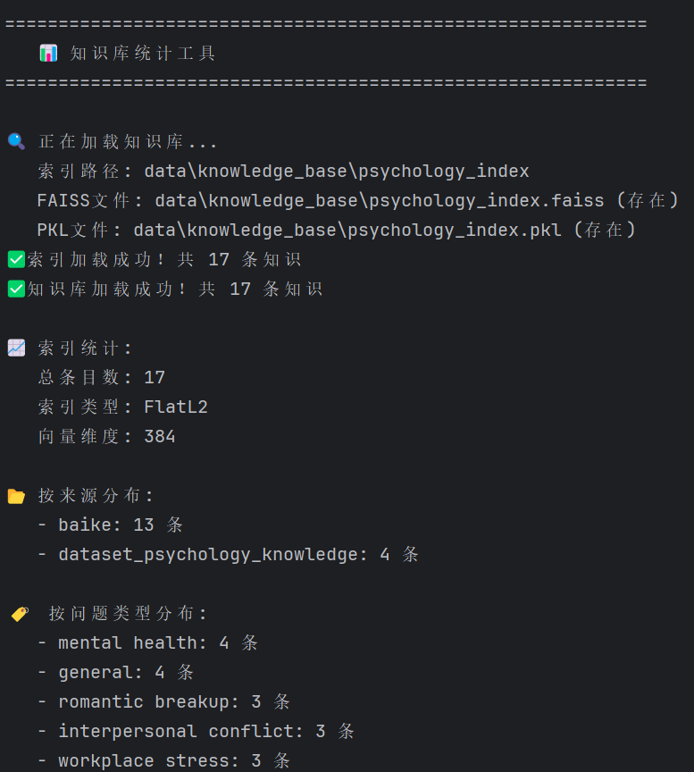
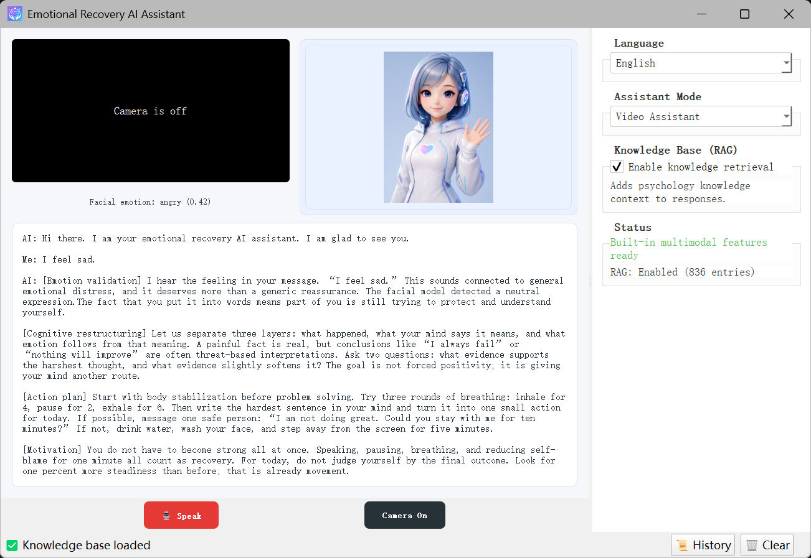
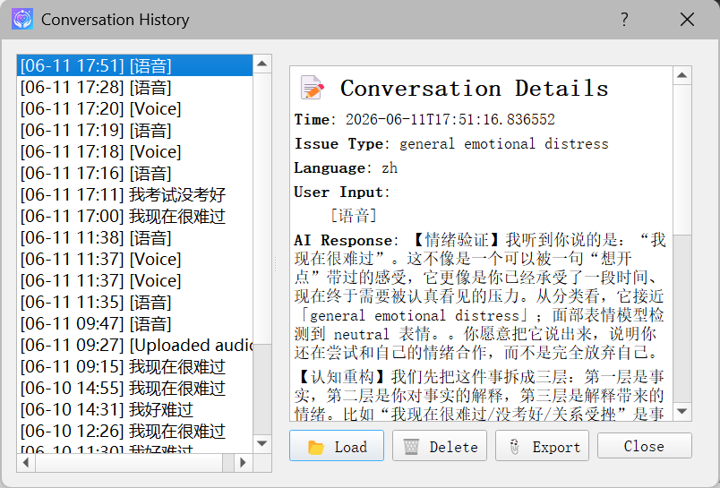

[简体中文](./README_zh.md) | English

# Local Multimodal Emotional Recovery AI Agent

This project is a local multimodal emotional recovery AI Agent. It integrates text sentiment recognition, speech recognition, voice reply generation, camera-based facial emotion recognition, OCR, RAG retrieval, and a FAISS vector database into one desktop application for structured, warm, and actionable emotional support.

The project is organized as a self-contained repository. Application code, algorithm source code, local model weights, knowledge-base indexes, history records, and configuration files live under the repository root. To share or upload the project, keep the current repository structure intact.

## Interface



## Key Features

- **Text Assistant**

  - Supports typed text input.
  - Supports image uploads and extracts text with OCR.
  - Uses a local Transformer text-classification algorithm for sentiment signals.
  - Combines RAG psychology knowledge with structured emotional recovery responses.

- **Voice Assistant**

  - Click the red bottom button to start recording, and click again to stop.
  - Recordings appear as playable voice bubbles.
  - Supports speech-to-text transcription.
  - AI replies are generated as voice bubbles that can be played, paused, and resumed.
  - In Chinese mode, transcription, visible text, AI replies, and AI voice are Chinese. In English mode, they are English.

- **Video Assistant**

  - Opens the local camera and shows a video-call style interface.
  - The upper-left area shows the user camera preview and real-time facial emotion result.
  - The upper-right area shows the AI assistant avatar.
  - The lower area shows the full video-call transcript.
  - Facial expression recognition runs continuously. Covered, blurred, too dark, or too bright frames are treated as no face detected.
  - The global status area only shows model loading / loaded states. Detailed emotion results stay under the camera preview.

- **Four-Section Emotional Recovery Response**
  - Emotional support: validates feelings with empathy.
  - Cognitive restructuring: identifies catastrophizing, all-or-nothing thinking, and overgeneralization.
  - Action plan: gives small, concrete, low-cost next steps.
  - Motivation: supports self-efficacy and forward movement.

- **RAG Psychology Knowledge Base**
  - Supports web crawling, local datasets, and enhanced built-in knowledge.
  - Supports PDF, JSON, JSONL, CSV, TXT, and MD.
  - Cleans, chunks, deduplicates, and incrementally updates knowledge.
  - Uses FAISS for low-latency vector retrieval.
  - Adds relevance thresholds, keyword fallback, low-value entry filtering, and emotion-sample filtering to avoid repeatedly returning generic knowledge or dataset snippets.
  - Stops quickly when system-level network blocking is detected instead of retrying every keyword.
  - Does not repeatedly append built-in fallback knowledge when it already exists.

- **Chinese / English Consistency**
  - Chinese mode keeps the interface, user speech transcript, AI response, AI voice, and video-call transcript in Chinese.
  - English mode keeps the interface, user speech transcript, AI response, AI voice, and video-call transcript in English.
  - Visible existing conversations are re-rendered after language switching.

- **Local History**

  - Saves conversation history locally.
  - Supports viewing, deleting, and exporting records.

## Tech Stack and Algorithms

| Module | Technology / Algorithm | Role |
|--------|------------------------|------|
| Desktop GUI | PyQt5 | Builds the text, voice, video, language switching, history, and runtime status interface. |
| Text Sentiment Recognition | Transformer text classification | Detects sentiment signals from user input. |
| Local Response Generation | Structured emotional recovery responder + optional local generative language model | Generates four-section responses from issue type, text sentiment, facial emotion, and RAG context. A trained local generator can be configured as a replacement. |
| ASR | Encoder-decoder speech recognition | Converts user recordings into text. English mode tries to transcribe/translate to English; Chinese mode outputs Simplified Chinese. |
| TTS | System local speech synthesis + optional neural speech generation | Converts AI responses into `.wav` audio and chooses Chinese or English voice according to the selected language. |
| Audio Processing | WAV recording, sample-rate control, voice-bubble playback | Records user speech, stores temporary audio, and supports play / pause / resume. |
| Facial Emotion Recognition | Haar Cascade face detection + lightweight CNN expression classification | Detects faces and classifies expressions with confidence and image-quality checks. |
| Camera Processing | OpenCV | Captures camera frames, displays live preview, and provides frames for facial emotion recognition. |
| OCR | Tesseract OCR + Pillow / OpenCV | Extracts text from uploaded images for sentiment analysis and RAG retrieval. |
| RAG Retrieval | Knowledge manager + vector search + keyword fallback | Retrieves relevant psychology knowledge, filters weak matches, generic entries, and emotion-expression samples, and reduces vague or unrelated responses. |
| Vector Database | FAISS | Stores and searches knowledge vectors with `.faiss` and `.pkl` persistence. |
| Embedding | 384-dimensional multilingual sentence vectors | Encodes Chinese and English psychology knowledge. Desktop inference uses local cache first to avoid long online downloads. |
| Web Crawler | requests + BeautifulSoup | Uses URL candidates, Wikipedia summary fallback, article extraction, and cleaning. It stops early when network blocking is detected. |
| Dataset Loader | JSON / JSONL / CSV / TXT / MD / PDF | Recursively loads `data/datasets/` and detects common text fields. |
| History | Local JSON storage | Stores user input, AI replies, issue type, mode, and language. |

## Clone Notice

This project includes local model weights managed by Git LFS. Install and enable Git LFS before cloning:

```powershell
git lfs install
git clone https://github.com/1zhangruifeng/Emotional-Recovery-AI-Agent.git
```

Without Git LFS, files under `models/` may be downloaded as pointer text files, and the app will not be able to load the models correctly.

The speech generation model is larger than the GitHub LFS single-file limit, so it is stored as split parts:

```text
models/speech_generation/lit_model.pth.part001
models/speech_generation/lit_model.pth.part002
```

When the speech model is first loaded, the app automatically rebuilds `models/speech_generation/lit_model.pth` from these parts. No manual merge is required.

## Installation

Install Python dependencies:

```powershell
pip install -r requirements.txt
```

For OCR, install the Tesseract OCR program separately and make sure `tesseract` is available in your system PATH.

## Build the Knowledge Base

Run:

```powershell
python scripts/build_knowledge_base.py
```

Options:

- `[1] Web crawler`: crawl psychology knowledge and incrementally add it to FAISS.
- `[2] Local dataset`: load PDF, JSON, CSV, TXT, MD, and other files from `data/datasets/`.
- `[3] Rebuild index`: rebuild the FAISS index from local datasets plus enhanced built-in psychology knowledge. Recommended after RAG / FAISS code updates.
- `[4] Deduplicate`: remove duplicate knowledge already stored in the index and rebuild FAISS.

View statistics:

```powershell
python scripts/show_knowledge_stats.py
```

Download public emotion datasets:

```powershell
python scripts/download_datasets.py
```

Notes:

- If network access is blocked, the crawler may return few results. The crawler stops early when system-level blocking is detected.
- If enhanced built-in knowledge already exists in the knowledge base, crawler failure will not append it repeatedly.
- The recommended clean setup is option `[3] Rebuild index`. The current project knowledge base is built from local datasets plus enhanced built-in psychology knowledge, about 828 entries.
- RAG retrieval filters emotion-expression samples, low-value encyclopedia entries, and weak matches, prioritizing practical psychology support knowledge such as CBT, sleep, stress, and interpersonal skills.
- Desktop inference uses local embedding cache first to avoid long online retries during chat.
- To allow automatic embedding-model download while building the knowledge base:

```powershell
$env:ALLOW_EMBEDDING_MODEL_DOWNLOAD="1"
python scripts/build_knowledge_base.py
```

## Launch

```powershell
python main.py
```

In the right panel you can select:

- Language: Chinese / English
- Assistant mode: Text / Voice / Video
- Whether to enable RAG retrieval

During first use, model loading status is displayed in the GUI, such as speech model loading, facial model loading, and vector retrieval. Ordinary users do not need to watch terminal logs.

## Project Structure

```text
repository root/
├── GUI/                    # PyQt5 interface
├── core/
│   ├── local_models.py     # Local multimodal model adapters
│   ├── knowledge_base.py   # RAG knowledge-base manager
│   ├── vector_index.py     # FAISS vector index
│   ├── crawler.py          # Psychology knowledge crawler
│   └── utils.py            # OCR and helper utilities
├── scripts/
│   ├── build_knowledge_base.py
│   ├── show_knowledge_stats.py
│   ├── download_datasets.py
│   └── train_local_models.py
├── third_party/
│   ├── speech_interaction/             # Speech interaction algorithm source
│   ├── facial_expression_recognition/  # Facial expression algorithm source
│   └── text_sentiment_recognition/     # Text sentiment algorithm source
├── models/
│   ├── speech_generation/          # Speech generation weights
│   ├── speech_recognition_small/   # Speech recognition weights
│   ├── neural_audio_codec/         # Neural audio codec weights
│   └── text_sentiment_classifier/  # Text sentiment classifier weights
├── data/
│   ├── datasets/           # Local knowledge files
│   ├── knowledge_base/     # FAISS index files
│   ├── history/            # Conversation history
│   ├── voice_outputs/      # Generated voice replies
│   └── model_config.json   # Local model path config
├── images/                 # GUI icon and AI assistant images
├── requirements.txt
└── main.py
```

## Safety Note

This project is for emotional support and learning / research purposes. It is not a replacement for professional therapy, medical diagnosis, or crisis intervention. If a user has self-harm thoughts, a concrete suicide plan, or cannot stay safe, they should immediately contact local emergency services, a crisis hotline, or a trusted person.
