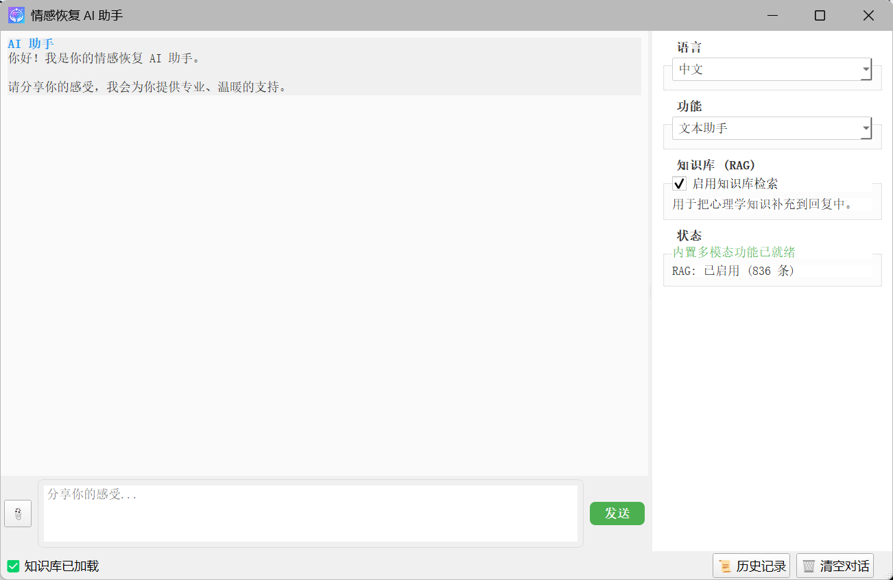
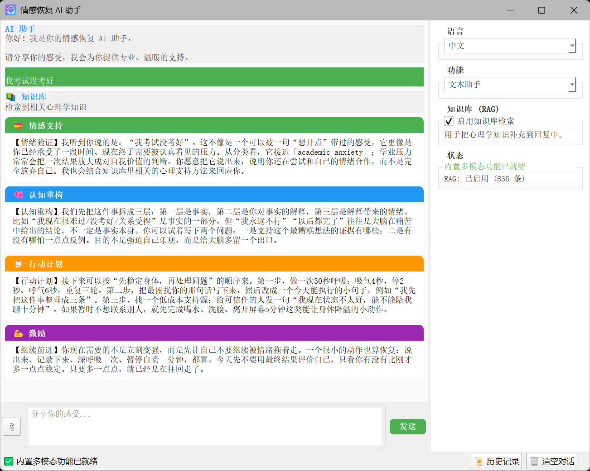
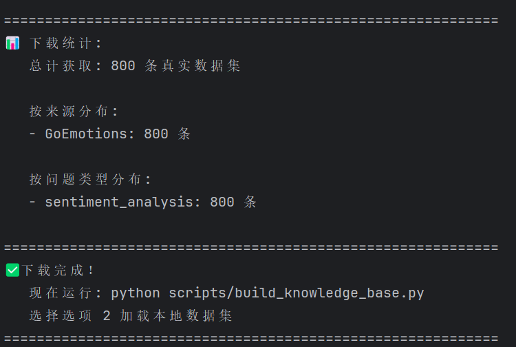
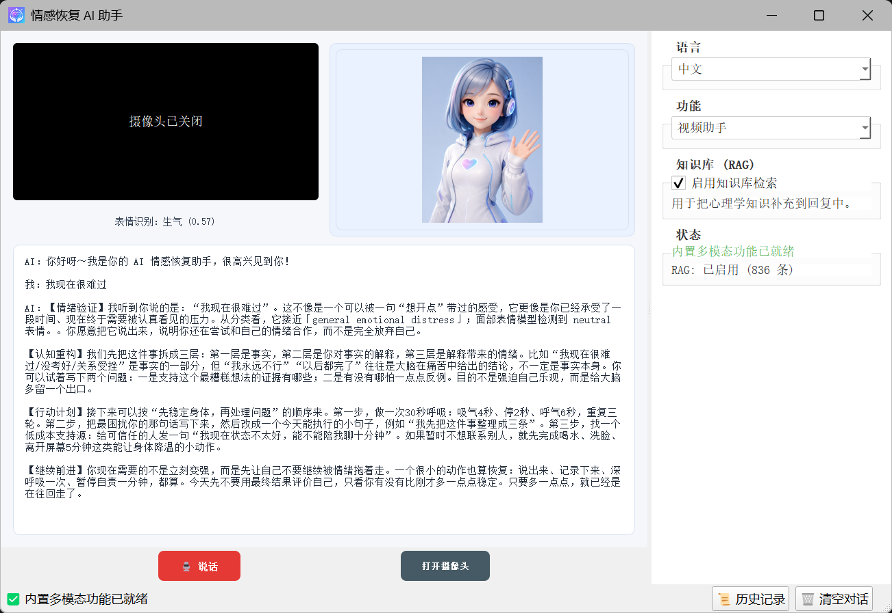
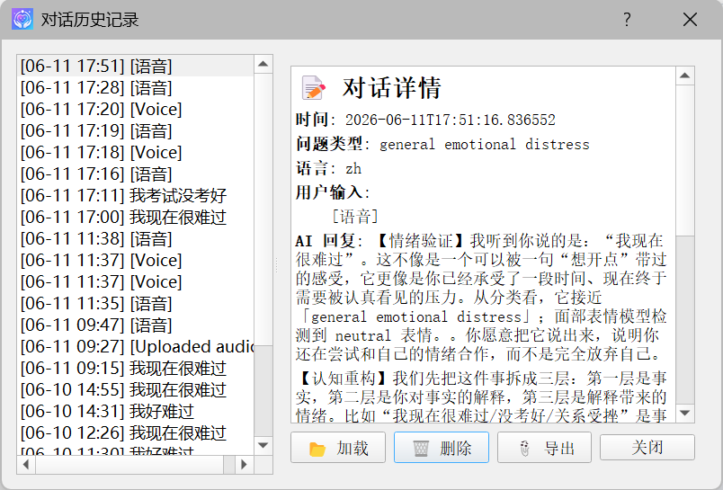

[English](./README.md) | 简体中文

# 本地多模态情感恢复 AI Agent

这是一个本地运行的多模态情感恢复 AI Agent。系统把文本情绪识别、语音识别、语音回复、摄像头面部表情识别、OCR 图片文字识别、RAG 检索增强和 FAISS 向量数据库整合到一个桌面应用中，为用户提供结构化、温暖、可执行的情感支持回复。

## 界面展示



## 核心功能

- **文本助手**

  - 支持直接输入文本。
  - 支持上传图片，并通过 OCR 提取图片文字。
  - 使用本地 Transformer 文本分类算法识别情绪倾向。
  - 结合 RAG 心理学知识库生成四段式情感恢复回复。

- **语音助手**

  - 点击底部红色按钮开始录音，再次点击停止。
  - 录音会显示为可播放的语音条。
  - 支持语音转文字。
  - AI 回复会生成语音条，可播放、暂停、继续播放。
  - 中文模式下语音识别、文字展示、AI 语音回复均为中文；英文模式下均为英文。

- **视频助手**

  - 自动打开本机摄像头，形成视频通话式界面。
  - 左上角为用户实时摄像头预览，下方显示实时面部情绪识别结果。
  - 右上角显示 AI 助手形象。
  - 下方显示完整视频通话文本记录。
  - 面部表情识别会持续运行；遮挡、模糊、过暗或过亮画面会被判定为未检测到人脸。
  - GUI 状态区只显示模型加载中/加载完成，具体情绪只显示在摄像头预览区域下方。

- **四段式情感恢复回复**
  - 情感支持：验证情绪，表达理解和接纳。
  - 认知重构：识别灾难化、绝对化、过度概括等负面思维。
  - 行动计划：给出短期、具体、低成本的下一步。
  - 激励：增强自我效能感，帮助用户继续向前。

- **RAG 心理学知识库**
  - 支持 Web 爬虫、本地数据集和增强内置知识。
  - 支持 PDF、JSON、JSONL、CSV、TXT、MD 等格式。
  - 自动清洗、分块、去重和增量更新。
  - 使用 FAISS 向量索引进行低延迟检索。
  - 检索加入相关性阈值、关键词兜底、低价值词条过滤和情绪样本过滤，避免每次都返回泛化知识或数据集短句。
  - 爬虫遇到系统级网络阻断时会快速停止，不会长时间逐个关键词重试。
  - 爬虫失败时不会重复追加已经存在的内置兜底知识。

- **中英文一致性**
  - 中文模式下界面、用户语音转写、AI 回复、AI 语音、视频通话文本均为中文。
  - 英文模式下界面、用户语音转写、AI 回复、AI 语音、视频通话文本均为英文。
  - 切换语言后，已有可见对话会根据当前语言重新渲染。

- **本地历史记录**

  - 自动保存对话历史。
  - 支持查看、删除和导出。

## 技术栈与算法

| 模块 | 技术 / 算法 | 作用 |
|------|-------------|------|
| 桌面 GUI | PyQt5 | 构建文本、语音、视频、多语言切换、历史记录和状态展示界面。 |
| 文本情绪识别 | Transformer 文本分类 | 对用户输入进行情绪倾向识别，为回复提供文本情绪信号。 |
| 本地回复生成 | 结构化情感恢复回复器 + 可选本地生成式语言模型 | 默认根据问题类型、文本情绪、面部情绪和 RAG 上下文生成四段式回复；也可以替换为自己训练的本地生成模型。 |
| 语音识别 ASR | 编码器-解码器语音识别算法 | 将用户录音转为文字，支持中英文模式。英文模式会尽量转写/翻译为英文，中文模式会输出简体中文。 |
| 语音回复 TTS | 系统级本地语音合成 + 可选神经语音生成 | 将 AI 回复生成 `.wav` 文件。系统会根据当前语言选择中文或英文语音。 |
| 音频处理 | WAV 写入、采样率控制、语音条播放 | 录制用户语音、保存临时音频、播放/暂停/继续播放语音条。 |
| 面部表情识别 | Haar Cascade 人脸检测 + 轻量 CNN 表情分类 | 检测人脸并分类表情；加入检测置信度、画面质量检查和遮挡过滤。 |
| 摄像头处理 | OpenCV | 读取摄像头帧、显示实时画面、保存帧供表情识别。 |
| OCR | Tesseract OCR + Pillow / OpenCV | 从用户上传图片中提取文字，用于情绪识别和 RAG 检索。 |
| RAG 检索增强 | 知识库管理器 + 向量检索 + 关键词兜底 | 检索与用户问题相关的心理学知识，过滤低相关结果、泛化词条和情绪表达样本，减少回复空泛和不相关内容。 |
| 向量数据库 | FAISS | 保存和检索知识向量，支持 `.faiss` 与 `.pkl` 持久化。 |
| Embedding | 384 维多语言句向量编码 | 对中文和英文知识文本进行语义向量化。桌面端默认优先使用本地缓存，避免运行时长时间联网下载。 |
| Web 爬虫 | requests + BeautifulSoup | 多 URL 候选、Wikipedia 摘要兜底、正文抽取和清洗；检测网络阻断后快速停止，避免长时间卡住。 |
| 数据集加载 | JSON / JSONL / CSV / TXT / MD / PDF | 递归读取 `data/datasets/`，自动识别常见文本字段。 |
| 历史记录 | JSON 本地存储 | 保存用户输入、AI 回复、问题类型、模式和语言。 |

## Clone 注意事项

本项目包含本地模型权重，模型文件使用 Git LFS 管理。克隆项目之前请先安装并启用 Git LFS：

```powershell
git lfs install
git clone https://github.com/1zhangruifeng/Emotional-Recovery-AI-Agent.git
```

如果没有安装 Git LFS，`models/` 下的模型文件可能只会下载成指针文本，程序将无法正常加载模型。

其中语音生成模型文件较大，已拆分为：

```text
models/speech_generation/lit_model.pth.part001
models/speech_generation/lit_model.pth.part002
```

程序首次加载语音模型时会自动合并为 `models/speech_generation/lit_model.pth`，用户不需要手动处理。

## 安装依赖

安装 Python 依赖：

```powershell
pip install -r requirements.txt
```

如果需要 OCR，请另外安装 Tesseract OCR 程序，并确保系统 PATH 中可以找到 `tesseract`。

## 构建知识库

首次运行或更新知识库：

```powershell
python scripts/build_knowledge_base.py
```

可选操作：

- `[1] 爬虫采集`：从网络采集心理学知识，并增量加入 FAISS。
- `[2] 本地数据集`：加载 `data/datasets/` 下的 PDF、JSON、CSV、TXT、MD 等文件。
- `[3] 重建索引`：用本地数据集 + 增强内置心理知识覆盖重建索引，推荐在更新 RAG/FAISS 代码后使用。
- `[4] 清理重复`：去除已有重复知识，并重建 FAISS 索引。

查看知识库统计：

```powershell
python scripts/show_knowledge_stats.py
```

下载公开情感数据集：

```powershell
python scripts/download_datasets.py
```

说明：

- 如果网络受限，爬虫可能返回较少内容；检测到系统级网络阻断后会提前停止。
- 如果知识库中已经存在增强内置知识，爬虫失败时不会再次重复追加。
- 当前推荐使用 `[3] 重建索引` 得到干净的本地知识库。项目当前知识库由本地数据集 + 增强内置心理知识构建，约 828 条。
- RAG 检索会过滤情绪表达样本、低价值百科词条和低相关结果，优先返回心理支持技巧、CBT、睡眠、压力、人际关系等实用知识。
- 桌面端默认优先使用本地 Embedding 缓存，避免聊天时长时间联网重试。
- 如需允许自动下载向量模型，可在构建知识库前设置：

```powershell
$env:ALLOW_EMBEDDING_MODEL_DOWNLOAD="1"
python scripts/build_knowledge_base.py
```

## 启动程序

```powershell
python main.py
```

启动后可在右侧选择：

- 语言：中文 / English
- 功能：文本助手 / 语音助手 / 视频助手
- 是否启用知识库检索 RAG

模型首次加载时，GUI 状态区域会显示加载进度，例如语音模型加载中、表情模型加载中、向量模型检索中等。普通用户不需要查看终端日志。

## 项目结构

```text
项目根目录/
├── GUI/                    # PyQt5 界面
├── core/
│   ├── local_models.py     # 本地多模态模型适配
│   ├── knowledge_base.py   # RAG 知识库管理
│   ├── vector_index.py     # FAISS 向量索引
│   ├── crawler.py          # 心理学知识爬虫
│   └── utils.py            # OCR、分类等工具
├── scripts/
│   ├── build_knowledge_base.py  # 构建 / 更新 RAG 知识库与 FAISS 索引
│   ├── show_knowledge_stats.py  # 查看知识库条目数量、来源和统计信息
│   ├── download_datasets.py     # 下载公开情感数据集到本地数据目录
│   └── train_local_models.py    # 本地模型训练入口示例
├── third_party/
│   ├── speech_interaction/             # 语音交互算法源码
│   ├── facial_expression_recognition/  # 面部表情识别算法源码
│   └── text_sentiment_recognition/     # 文本情绪识别算法源码
├── models/
│   ├── speech_generation/          # 语音生成权重
│   ├── speech_recognition_small/   # 语音识别权重
│   ├── neural_audio_codec/         # 神经音频编解码权重
│   └── text_sentiment_classifier/  # 文本情绪分类权重
├── data/
│   ├── datasets/           # 本地知识文件
│   ├── knowledge_base/     # FAISS 索引
│   ├── history/            # 对话历史
│   ├── voice_outputs/      # 语音回复输出
│   └── model_config.json   # 本地模型路径配置
├── images/                 # GUI 图标与 AI 助手图片
├── requirements.txt
└── main.py
```

## 安全说明

本项目面向情感支持和学习研究场景，不能替代专业心理咨询、医疗诊断或危机干预。如果用户出现自伤风险、明确自杀计划或无法保证安全，应立即联系当地急救、危机热线或可信任的人。
